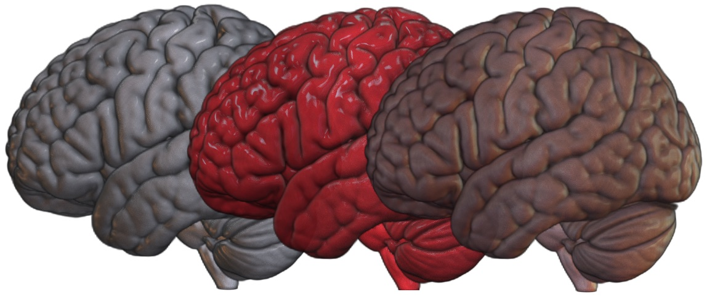
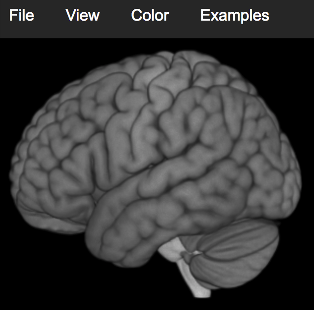

# NIfTI WebGL Volume Rendering

[Try the demo](https://rordenlab.github.io/).

This project allows users to open and view NIfTI format images, which are popular for scientific neuroimaging. One can convert the complicated DICOM format popular in medical imaging to the simpler NIfTI format using free tools like [dcm2niix](https://github.com/rordenlab/dcm2niix).

By using webGL 2, these renderings can be viewed with web browsers on any computer, including tablets and smart phones (though be aware that Apple's iOS does not yet support WebGL 2). The idea for this project is to provide a web-based tool with similar functions to tools like [MRIcroGL](https://www.nitrc.org/plugins/mwiki/index.php/mricrogl:MainPage) that is available for [Windows, Linux and MacOS](https://github.com/rordenlab/MRIcroGL12/releases).

This software calculates the volume intensity [gradients](https://www.mccauslandcenter.sc.edu/mricrogl/gradients). This isolates regions where the brightness of the volume changes (for brain scans, these are the boundaries between different tissues). The software estimates both the gradient magnitude (is the brightness changing rapidly at this location) and the gradient direction (what direction is the surface oriented). This allows us to calculating lighting effects.

The "Shader" menu allows you to explore different methods for coloring the volume. The default shader uses [MatCaps](http://www.alecjacobson.com/weblog/?p=4827) to color the volumes.

# Limitations

This project is currently a prototype. It lacks several features of mature tools like [MRIcroGL](https://github.com/rordenlab/MRIcroGL12/releases). Some limitations include:

 - Spatial orientation (the NIfTI SForm and QForm) are ignored. An image may be loaded in an unfamiliar orientation, and it might event show a brain left-right mirror reversed!
 - It assumes volumes are anisotropic. If an image is isotropic (e.g. 1mm between voxels in each dimension) it will look fine, but if the image is anisotropic (e.g. 1mm in the left-right and anterior-superior directions, but 2mm in the inferior superior direction) the image may appear distorted.
 - It does not load overlay images: you can only view a single volume at a time.

# Components

 - Will Usher's [WebGL Volume rendering](https://github.com/Twinklebear/webgl-volume-raycaster).
 - Will Usher's [WebGL utilities](https://github.com/Twinklebear/webgl-util).
 - RII-UTHSCSA's [NIFTI-Reader](https://github.com/rii-mango/NIFTI-Reader-JS).
 - [glMatrix](http://glmatrix.net/) for matrix/vector operations.
 - [pako](https://github.com/nodeca/pako) for GZip decompression.

## Installation

You need to have a web server. You simply copy the files from this repository to a folder that will be hosted as a web page. If you do not have a web server, you can make a free [github](https://www.khanacademy.org/computing/computer-programming/html-css/web-development-tools/a/hosting-your-website-on-github) repository that will be shared as a website. If you do use Github, make sure you do not copy this README.md file to you repository (the README file will be shown as a web page instead of the index.html file). An example of a Github-based web server is here [here](https://rordenlab.github.io/).

# Alternatives

 - [AMI supports volume rendering](https://github.com/FNNDSC/ami)
 - Leandro Roberto Barbagallo's [volume renderer](http://www.lebarba.com/)
 - [med3web](https://github.com/epam/med3web) has an [elegant interface](https://med3web.opensource.epam.com/)
 - [Roland Rytz's volume rendering](https://github.com/RolandR/VolumeRayCasting)
 - [ShareVol](https://github.com/OKaluza/sharevol) by [Owen Kaluza](http://owen.kaluza.id.au/sharevol/)
 - [three.js](https://threejs.org/examples/webgl2_materials_texture3d_volume.html) can read NRRD format images
 - [vtk-js](https://kitware.github.io/vtk-js/examples/VolumeViewer.html) loads vti format images
 - [XTK](https://github.com/xtk/X)

## Images

# neuro-webgl
